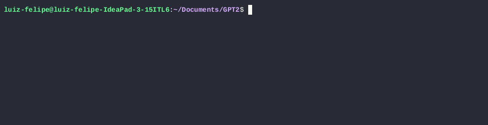

# GPT-2 in C




Este projeto tem como objetivo recriar a inferência do modelo GPT-2 inteiramente em C, partindo dos pesos originais do modelo e implementando manualmente todas as etapas necessárias para a geração de texto.

A aplicação funciona como um modelo de linguagem autoregressivo: dado um *prompt* inicial, o sistema prevê o próximo token e o adiciona à sequência, repetindo esse processo para completar o texto de forma contínua, de maneira semelhante ao GPT-2 original.

## Motivação

O principal motivo da escolha da linguagem **C** é a busca por alto desempenho e controle total sobre memória, layout de dados e otimizações de baixo nível. A ideia é criar uma base que permita:
- otimizações agressivas de performance,
- fácil portabilidade para ambientes restritos,
- maior compreensão interna do funcionamento do GPT-2.

Apesar disso, o projeto utiliza Python de forma auxiliar, apenas para tarefas de desenvolvimento, como:
- download dos pesos do modelo,
- scripts de teste automatizados,
- validação da saída do código em C.

A inferência em si é feita exclusivamente em **C**.

---

## Como o projeto funciona

De forma resumida, o fluxo é:

1. O usuário fornece um *prompt* de texto.
2. O prompt é tokenizado de acordo com o vocabulário do GPT-2.
3. O modelo executa a inferência token a token:
   - embeddings
   - camadas Transformer (self-attention + MLP)
   - normalizações
4. O próximo token é previsto e anexado à sequência.
5. O processo se repete até atingir o tamanho desejado (máximo de 30 tokens).

---

## Instalação e uso

### 1. Clonar o repositório

```bash
git clone https://github.com/LuizF14/gpt-in-C.git
cd gpt-in-C
```

### 2. Instalando dependências Python
``` bash
pip install -r requirements.txt
``` 

### 3. Download dos pesos do modelo
``` bash 
python download_model.py
```
Após isso, a pasta `bin/` conterá todos os arquivos `.bin` e `.shape` necessários para a inferência.

### 4. Compilação do projeto
O projeto utiliza um *Makefile* para gerenciar a compilação.
``` bash
make gpt2
``` 
O binário será gerado na pasta `build/gpt2`

### 5. Executar 
Após a compilação:
``` bash
cd build
./gpt2
``` 

## Testes automatizados
Os testes ficam na pasta `tests/` e seguem uma abordagem híbrida:
* Código C: executam código específico a ser testado.
* Scripts Python: executam testes automatizados e comparam saídas.
Estrutura: 
```
tests/
├── c
│   └── códigos em C
└── python
    └── scripts de validação e comparação
``` 

## Estrutura do projeto
```
.
├── bin
│   ├── *.bin
│   ├── *.shape
│   └── vocab.csv
│
├── build
│   └── gpt2
│
├── download_model.py
├── Makefile
├── requirements.txt
│
├── src
│   ├── GPT2_lib
│   │   ├── encoder.c
│   │   ├── transformer.c
│   │   ├── math_utils.c
│   │   ├── load.c
│   │   └── GPT2_lib.c
│   └── main.c
│
└── tests
    ├── c
    └── python
``` 
* `bin/`: Contém os pesos do modelo GPT-2 e arquivos auxiliares (.bin, .shape, vocab.csv).

* `build/`: Contém os executáveis gerados após a compilação.

* `src/`: Código-fonte principal do projeto: implementação do tokenizer, camadas Transformer,operações matemáticas, carregamento dos pesos.

* `tests/`: Infraestrutura de testes automatizados, combinando C e Python.

* `download_model.py`: Script auxiliar para baixar e preparar os pesos do modelo.

* Makefile: Gerencia a compilação do projeto.
